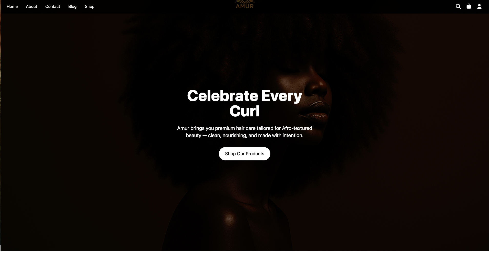
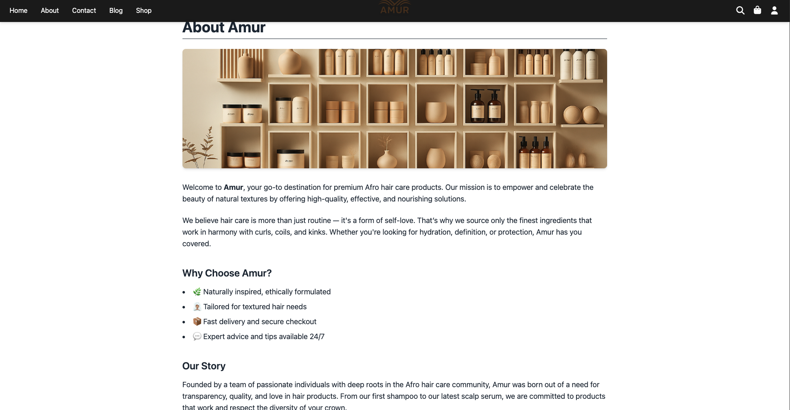
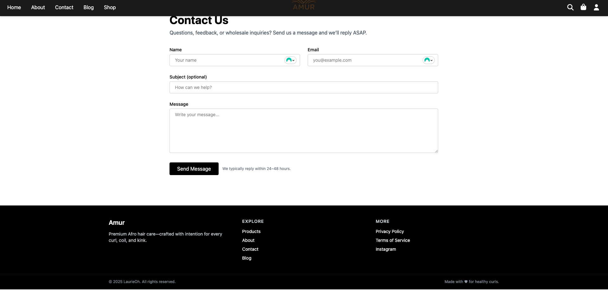
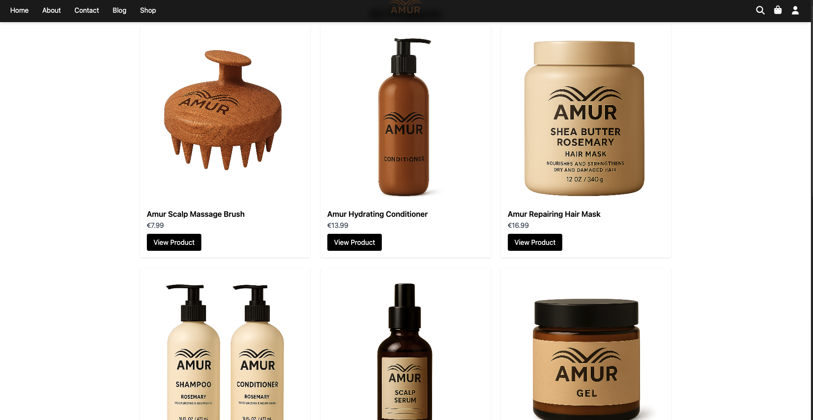
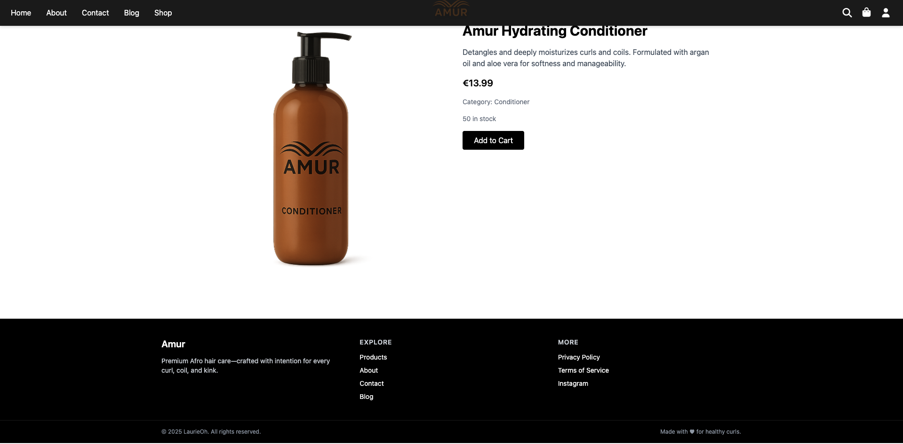
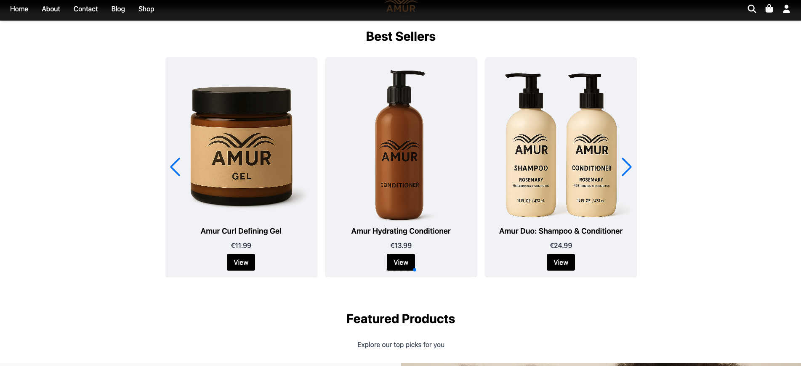
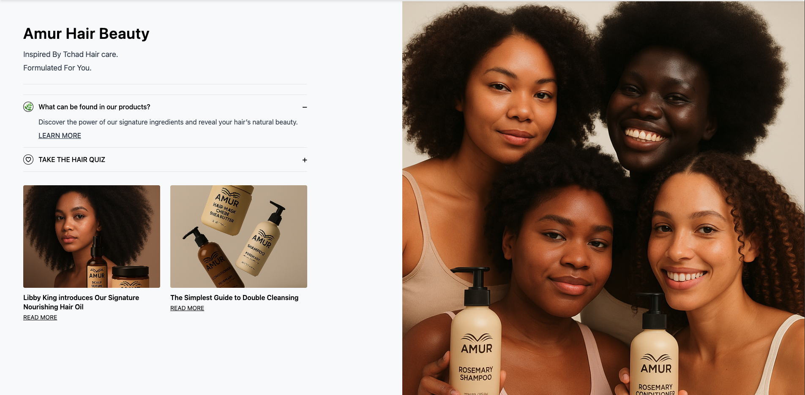
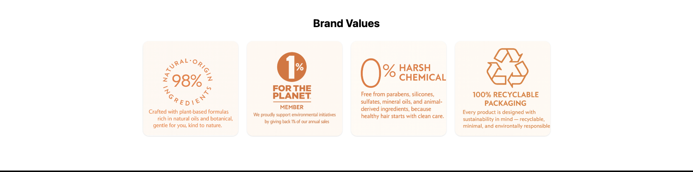

🌿 AMUR — Premium Afro Hair Care E-Shop

A modern e-commerce experience celebrating natural Afro-textured beauty, inspired by ancient African beauty rituals and plant-based hair care.

📸 Project Preview

 

 

Brand Values

🌱 About the Project

AMUR is a full-stack e-commerce application created to highlight and uplift the beauty of natural Afro-textured hair.
It features plant-based formulations and hair care rituals inspired by ancient African traditions, blending modern UI/UX with cultural heritage.

The project delivers a premium shopping experience with a minimalist, warm aesthetic centered on representation, wellness, and inclusivity.

🧡 The Story Behind AMUR

Growing up in France, representation for Afro hair was rare.
Straight hair dominated beauty standards, and like many, I was taught that my curls were something to “fix,” not cherish. Chemical treatments, straightening, and damaging routines were considered normal.

Everything changed when I discovered the emerging Afro hair community — French brands like Ethnicia, and international bloggers who openly shared natural routines, rituals, and love for their heritage.

For the first time, I learned:

how to care for my natural hair

why it behaved the way it did

and how beautiful curls, coils, and kinks truly are

✨ AMUR is a tribute to that rediscovery of identity, confidence, and cultural beauty.

It is built for everyone who wants:

Authentic information

Clean, plant-based hair care

Representation

A safe space to celebrate natural beauty

✨ Features
🌟 Homepage

Full hero banner spotlighting Afro-textured hair

Clean call-to-action: Shop Our Products

🏡 About Page

Mission statement

Brand philosophy

Story (rooted in African beauty practices + modern care)

Why Choose Us? section (with icons)

📞 Contact Page

Functional message form

Accessible layout

24–48h expected reply time

🛍️ Shop Page

Product grid

High-quality renders of every product

Product categories (shampoo, conditioner, oils, gel, tools…)

🛒 Product Page

Large bottle visual

Description + ingredients tone

Stocks, categories

Add to Cart functionality

🥇 Best Sellers Slideshow

Interactive product slider

Modern layout with smooth transitions

🌍 Brand Values

Natural-origin ingredients

Sustainability

Clean beauty

Fully recyclable packaging

🎯 User Experience Vision
1. Representation At the Center

The website visually elevates the beauty of Afro-textured hair.

2. Premium Minimalist Design

An aesthetic inspired by:

earthy tones

melanin-rich palettes

natural textures

African design elements

3. Smooth Navigation

Clear routes:

Homepage

About

Contact

Blog

Shop

4. Education Embedded in the UI

Hair quiz

Ingredient breakdowns

Blog posts

Rituals inspired by African traditions

🧪 Technical Features
Frontend

React (Vite)

React Router

Context API (Cart & Auth)

Axios

CSS / Tailwind (if used)

FontAwesome icons

Backend (if applicable)

Node.js

Express

MongoDB / Mongoose

Other Tools

VS Code

Figma

Custom product renders

👩🏾‍🦱 Target Audience

People with curls, coils, and kinks

Those transitioning from chemical treatments

Consumers looking for natural and ethical hair care

Users who want a premium, inclusive hair experience

Anyone curious about ancient African beauty rituals

🔮 Future Improvements

Secure checkout (Stripe)

Auth system (register/login)

Wishlist

Blog with CMS

Hair quiz with personalized recommendations

Admin dashboard

User reviews

Multi-language support (EN/FR/DE)

🧰 Installation & Setup
# Clone the repository
git clone https://github.com/LaurieOh1/Project-Shop

# Install dependencies
npm install

# Start development server
npm run dev

# Build for production
npm run build

📁 Folder Structure (example)
/src
  /components
  /pages
  /context
  /assets
  /data
  App.jsx
  main.jsx

❤️ Credits

AMUR was created with love, intention, and deep respect for
every curl, coil, and kink.

A celebration of heritage.
A statement of beauty.
A modern digital experience.
